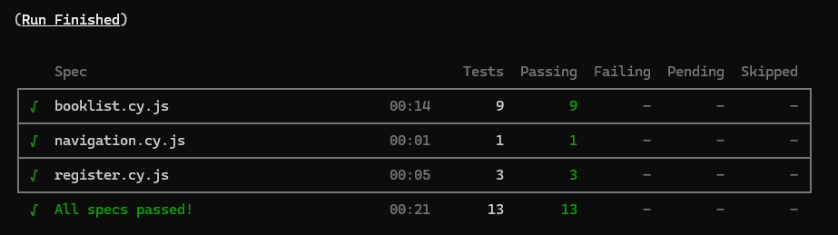
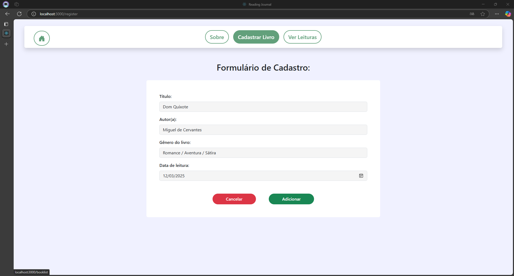
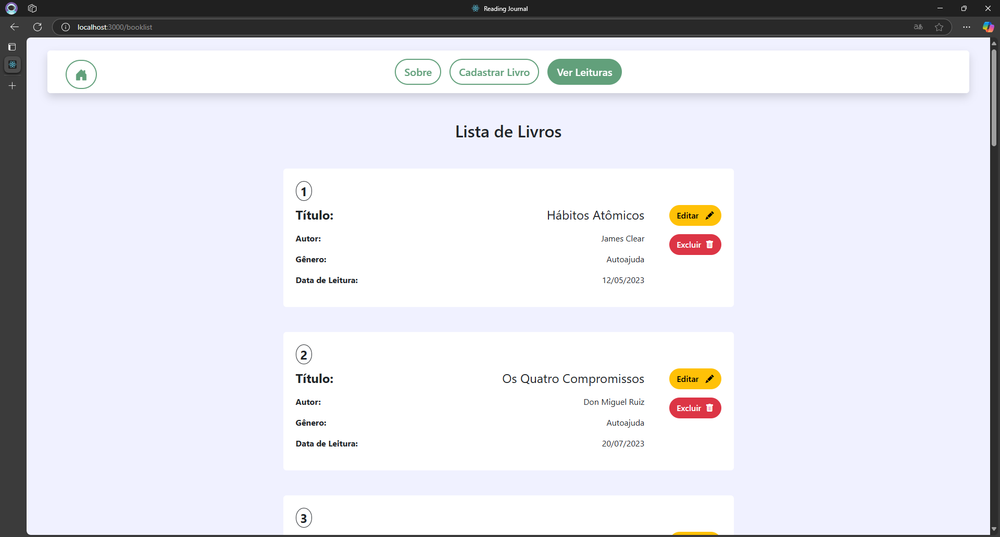
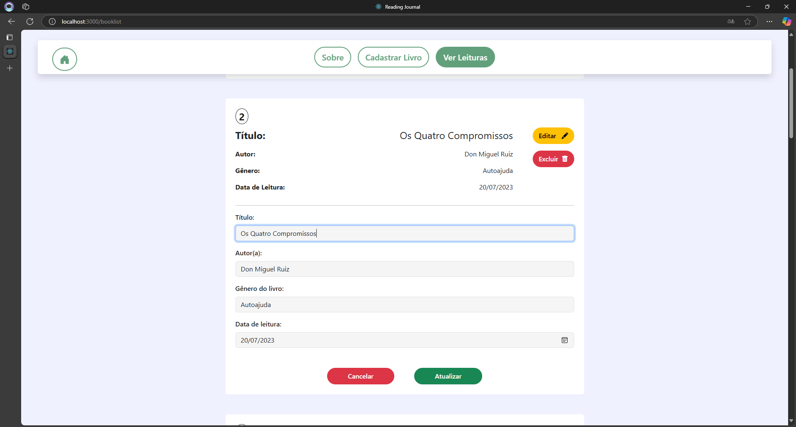
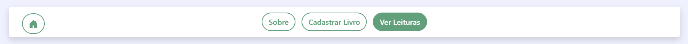
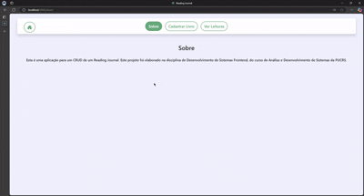
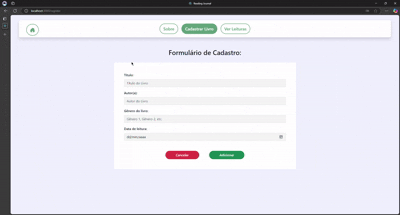
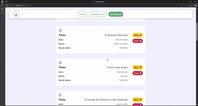
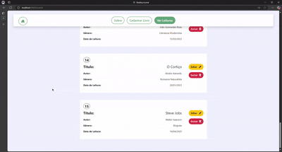

# Reading Journal 📚

**Desenvolvido por:** Felipe Zago  
Aplicação CRUD de um diário de leitura. Projeto elaborado para a disciplina de **Desenvolvimento de Sistemas Frontend**, do curso de **Análise e Desenvolvimento de Sistemas da PUCRS (5° trimestre)**.

---

## 🛠 Tecnologias Utilizadas


---

## ▶️ Como Executar o Projeto

1. Clone este repositório ou descompacte o `.zip`:
   ```bash
   git clone https://github.com/SeuUsuario/Reading-Journal.git
   ```

2. Clone e execute o back-end necessário:
   - Repositório: https://github.com/adsPucrsOnline/DesenvolvimentoFrontend/
   - No terminal:
     ```bash
     cd DesenvolvimentoFrontend/readingJournal-api/
     npm install
     npm start
     ```

   > **Obs:** A API deve rodar em `http://localhost:5000/`. Caso contrário, altere a URL em `src/services/api/api.js` e nos testes Cypress em `cypress/tests/e2e/*`.

3. Navegue até a pasta do frontend:
   ```bash
   cd exemplos/context-react-project
   npm install
   npm start
   ```

4. Após execução, o resultado esperado é:
   

---

## ✅ Testes

Este projeto possui testes automatizados com **Cypress**.

- Rodar testes em modo headless:
  ```bash
  npm test
  ```

- Abrir interface gráfica do Cypress:
  ```bash
  npx cypress open
  ```



---

## 📦 Componentes

### `ChildrenComponent`

- **Props:** `items`, `onAdd`
- **Função:** renderiza uma lista de dados e adiciona novos via callback.

### `List`

- Usa o `ChildrenComponent` com dados do contexto, disparando alterações via callback.

### `Navbar`

- Usa `Link` do `react-router-dom` para navegar entre páginas.

### `BookForm.js`

- Formulário para adicionar ou editar livros.
- Props: `bookToEdit`, `setBookToEdit`, `setUpdateHappened`
- Validações simples + requisições ao back-end + alertas.



### `BookList.js`

- Props: `bookList`, `setUpdateHappened`
- Mapeia lista de livros e exibe opções de editar e excluir.




### `NavBar.js`

- Barra de navegação fixa com estilização para itens ativos/hover.



---

## 🖥️ Demonstração de Uso

### Navegação



### Cadastro de Livros



### Editar Livros



### Excluir Livros



---

## 📌 Considerações Finais

Este projeto foi desenvolvido para fins didáticos e demonstra funcionalidades como:

- React Context API
- React Router
- Comunicação Frontend ↔ Backend
- Testes End-to-End com Cypress

Obrigado por conferir o projeto! 🚀
