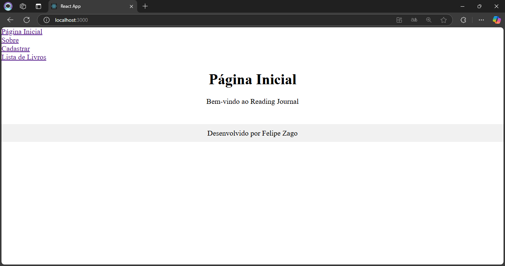
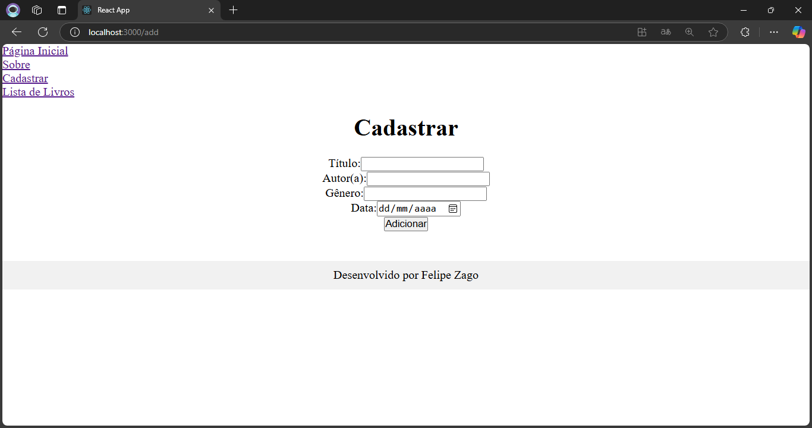
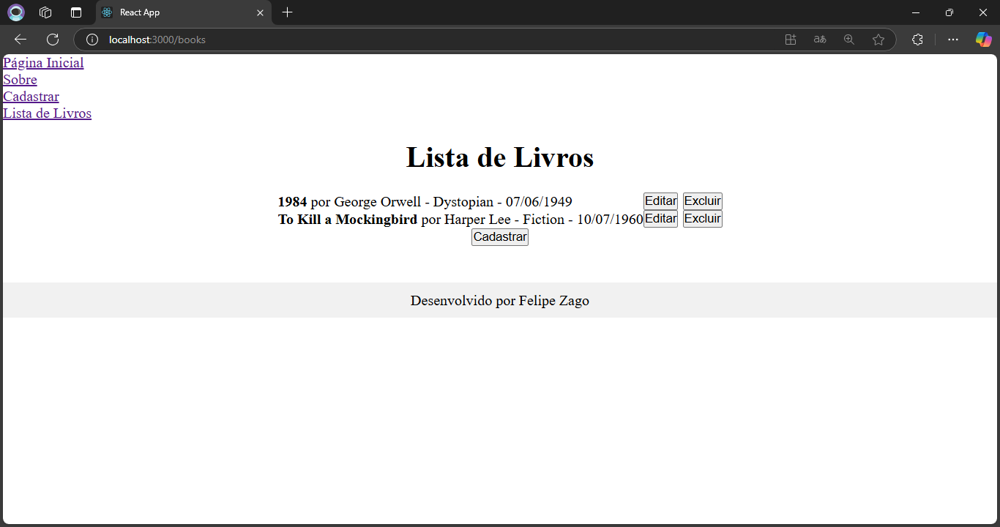
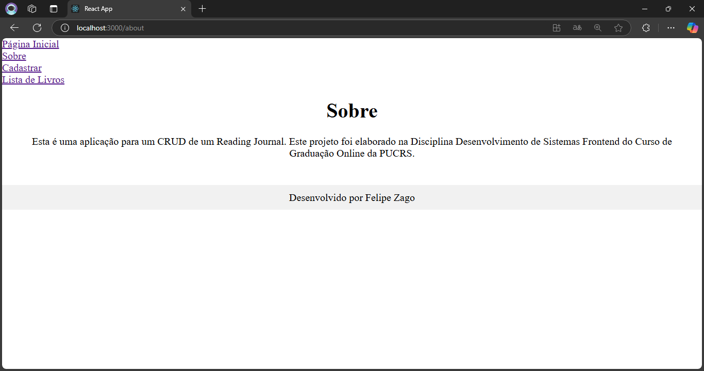
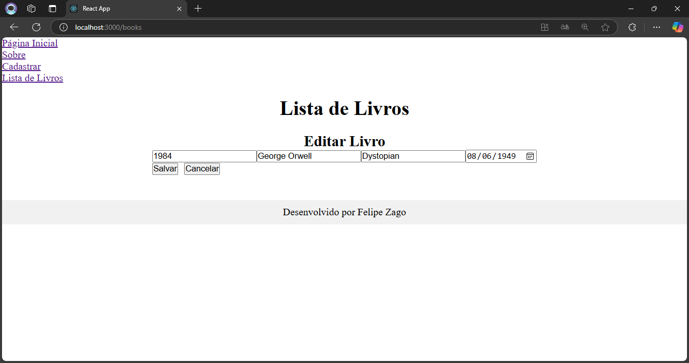

# Reading Journal - Fase 1

## Informações do Projeto

- **Aluno**: Felipe Zago
- **Curso**: Análise e Desenvolvimento de Sistemas - PUCRS
- **Matéria**: Desenvolvimento de Sistemas Frontend

## Descrição

Este projeto é uma aplicação simples de CRUD (Create, Read, Update, Delete) para um "Reading Journal", ou seja, um inventário de livros lidos. Ele foi desenvolvido como parte da disciplina de Desenvolvimento de Sistemas Frontend do curso de Análise e Desenvolvimento de Sistemas. A aplicação permite ao usuário adicionar, editar, excluir e visualizar livros registrados no sistema.

## Tecnologias Utilizadas

- React.js
- React Router DOM
- Hooks (useState, useEffect)
- CSS para estilização

## Funcionalidades

1. **Cadastro de Livros:**
   - O usuário pode adicionar um novo livro fornecendo as informações de Título, Autor(a), Gênero e Ano.
   
2. **Listagem de Livros:**
   - A lista de livros exibirá os dados cadastrados com a possibilidade de edição e exclusão.
   
3. **Edição de Livros:**
   - O usuário pode editar as informações de um livro já registrado.
   
4. **Exclusão de Livros:**
   - O usuário pode excluir livros da lista.

5. **Validação de Formulário:**
   - O formulário de cadastro garante que todos os campos sejam preenchidos antes de permitir o envio.

## Estrutura do Projeto

### Componentes

- **BookList**: Componente que exibe a lista de livros cadastrados.
- **BookForm**: Componente que contém o formulário para cadastro e edição de livros.
- **NavBar**: Componente de navegação da aplicação.
- **Footer**: Componente que exibe o rodapé da página.
- **Pages**:
  - **HomePage**: Página inicial da aplicação.
  - **AboutPage**: Página com informações sobre o projeto.
  - **AddBookPage**: Página para adicionar um novo livro.
  - **BooksPage**: Página que exibe a lista de livros com opções de editar e excluir.

## Como Executar o Projeto

1. Clone este repositório para a sua máquina local:
   ```bash
   git clone [https://github.com/FelipeZag0/lista-de-tarefas-React]
   ```
   
2. Navegue até o diretório do projeto:
   ```bash
   cd seu-repositorio
   ```

3. Instale as dependências:
   ```bash
   npm install
   ```

4. Inicie o servidor de desenvolvimento:
   ```bash
   npm start
   ```

5. Abra o navegador e acesse a aplicação em:
   ```
   http://localhost:3000
   ```

## Componentes e Funções

- **BookList**: Exibe a lista de livros com título, autor, gênero e data. Permite editar e excluir livros.
- **BookForm**: Formulário para inserir um novo livro ou editar um livro existente. Exige preenchimento de todos os campos antes de permitir o envio.
- **NavBar**: Barra de navegação com links para a página inicial, sobre, cadastro de livros e lista de livros.
- **Footer**: Exibe o nome do desenvolvedor no rodapé da página.

<<<<<<< HEAD

## Capturas de Tela








## Considerações Finais

Este projeto foi uma ótima oportunidade de aplicar conhecimentos de React e desenvolvimento frontend. Fico aberto a sugestões de melhorias e contribuições. Obrigado por conferir!

---

Desenvolvido por **Felipe Zago**.
