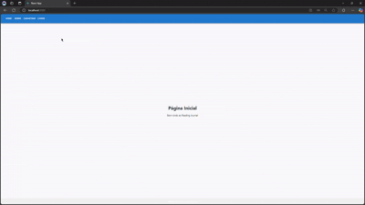

# Nome: Felipe Zago

## Para executar este projeto:

1. Clone este repositório para sua máquina local:
   ```bash
   git clone [https://github.com/FelipeZag0/reading-journal]

2. Entre na pasta do projeto no terminal:
   ```bash
   cd reading-journal
   ```

3. Rode `npm install` para instalar as dependências do projeto:
   ```bash
   npm install
   ```

4. E em seguida, rode `npm start` para iniciar a execução do projeto:
   ```bash
   npm start
   ```
## Demonstração

Após a execução do projeto, este é o resultado esperado no navegador:  



Este projeto é uma aplicação de **Reading Journal** (Diário de Leitura), criada para registrar livros lidos. Desenvolvido com **React.js**, ele permite que os usuários adicionem, editem, excluam e visualizem livros registrados.

### Funcionalidades

- **Cadastro de Livros**: Adicione livros com informações como título, autor, gênero e ano.
- **Edição de Livros**: Edite as informações de um livro já registrado.
- **Exclusão de Livros**: Remova livros do registro.
- **Listagem de Livros**: Veja todos os livros registrados, com a possibilidade de editar ou excluir.

A aplicação foi desenvolvida utilizando **React.js** e outras tecnologias modernas do ecossistema frontend.

## Componentes

Os componentes estão no diretório `./src/components` e possuem as seguintes características:

- **BookList**:
  - **Descrição**: Este componente exibe a lista de livros cadastrados, permitindo a edição e a exclusão de livros.
  
- **BookForm**:
  - **Descrição**: Componente que contém o formulário para adicionar ou editar livros. Ele exige o preenchimento de todos os campos antes de enviar.
  
- **NavBar**:
  - **Descrição**: Componente que utiliza o `Link` do React Router para mostrar as páginas disponíveis na barra de navegação (ex: página inicial, adicionar livro, lista de livros).
  
- **Footer**:
  - **Descrição**: Exibe o rodapé com informações adicionais sobre o desenvolvedor.

## Conclusão

Este projeto foi desenvolvido com o objetivo de praticar a criação de uma aplicação simples com React. Ele serve para demonstrar como criar um CRUD básico, manipular formulários, gerenciar estados e implementar navegação entre páginas utilizando o React Router.

---
Desenvolvido por **Felipe Zago** - **PUCRS**
```
